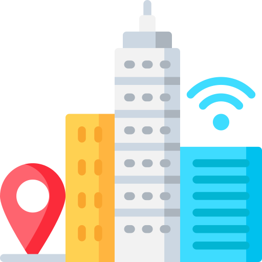

<!-- PROJECT LOGO -->
 

  
  <h1 align="center">Smart-City Digital Twin for Autonomous Vehicles Support</h1>

<!-- ABOUT THE PROJECT -->
## About The Project

Urban or city digital twins are a virtual representation of a city's physical assets, using data, data analytics and machine learning to build simulation models that can be updated and changed (real-time) as their physical equivalents change. This project is core for Theia's autonomous vehicles project for leveraging all the research being accomplished and its focus relies on using the FIWARE ecosystem and extending it to support the digital twin. 

### Built With

<!-- GETTING STARTED -->
## Getting Started

To run this project locally, please follow these steps.

### Prerequisites
wip

### Installation
wip

<!-- CONTACT -->
## Contact

Francisco Gonçalves - franciscorg.dev@gmail.com
